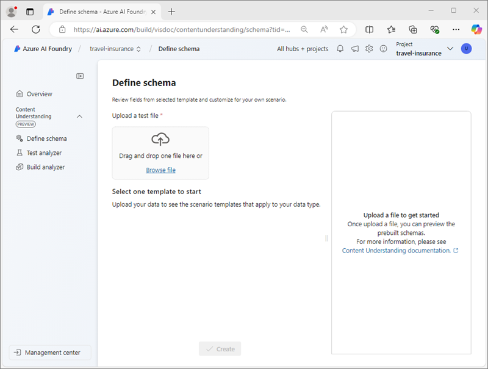
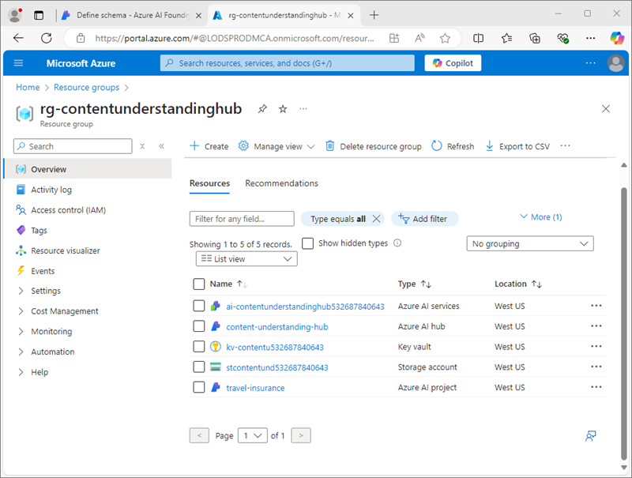
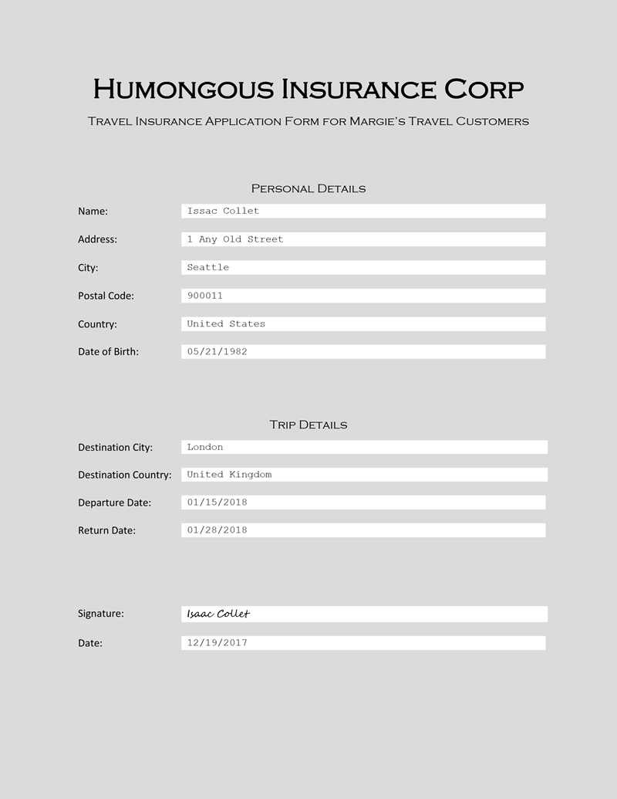
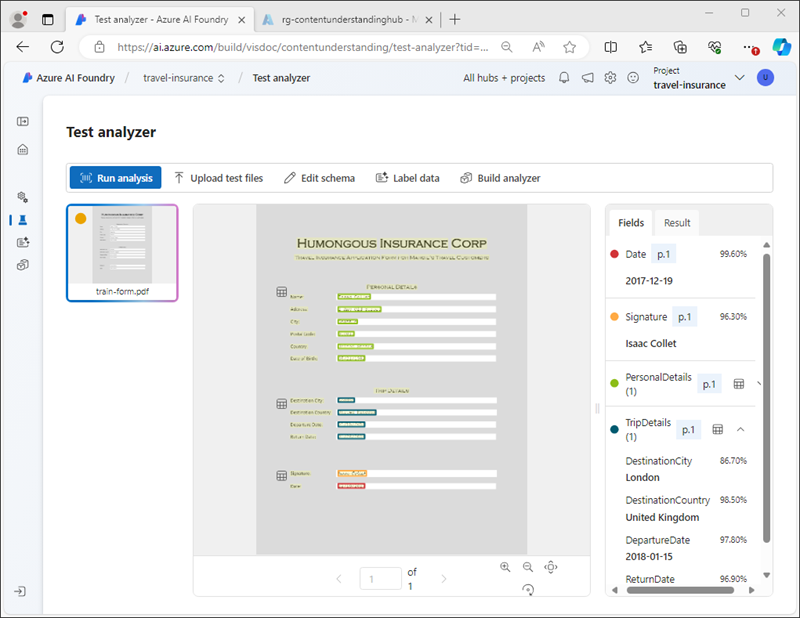
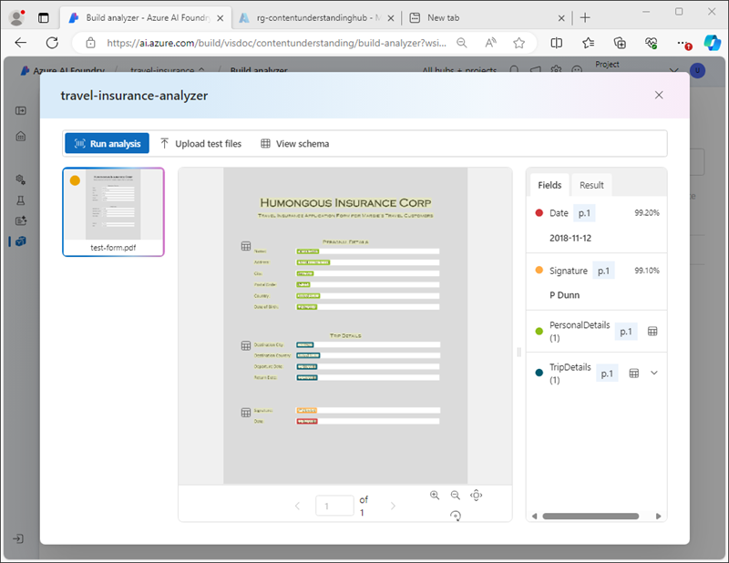
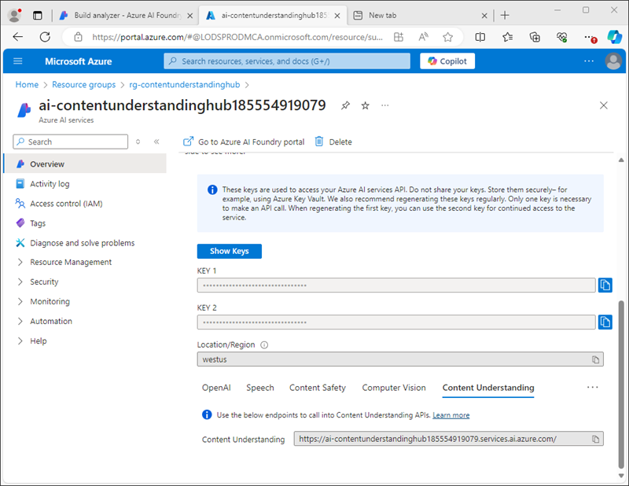
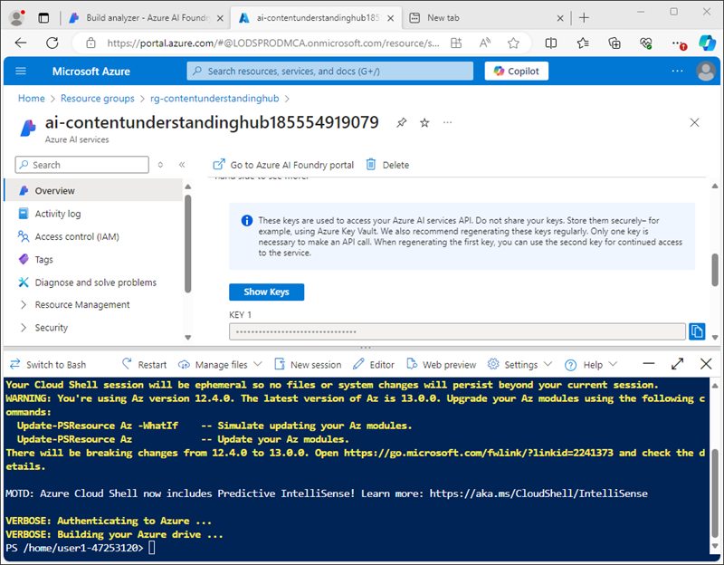
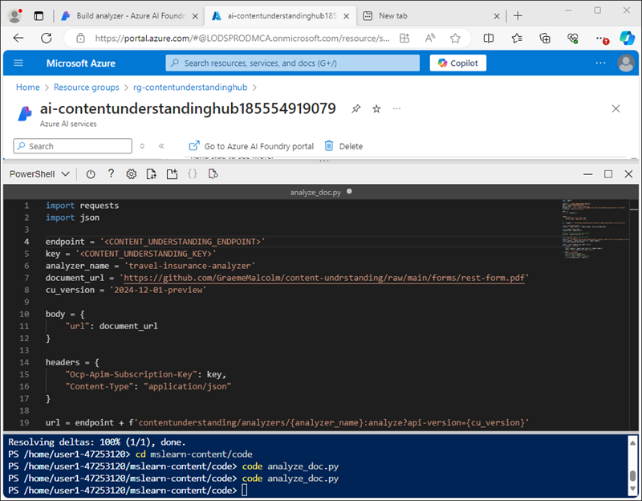

---
lab:
    title: 'Analyze documents with Azure AI Content Understanding'
    module: 'Multimodal analysis with Content Understanding'
---

# Analyze documents with Azure AI Content Understanding

In this exercise, you use Azure AI Foundry portal to create a Content Understanding project that can extract information from travel insurance policy forms. You'll then test your content analyzer in Azure AI Foundry Portal and consume it through the Content Understanding REST interface.

This exercise takes approximately **30** minutes.

## Create a Content Understanding project

Let's start by using the Azure AI Foundry portal to create a Content Understanding project.

1. In a web browser, open the [Azure AI Foundry portal](https://ai.azure.com) at `https://ai.azure.com` and sign in using your Azure credentials.

    The home page of Azure AI Foundry portal looks similar to the following image:

    

1. In the **Find it fast** section of the home page, towards the bottom, select **Content Understanding**.
1. On the **Content Understanding** page, select the **Create new Content Understanding project** button.
1. On the **Project overview** step, set the following properties for your project; then select **Next**:
    - **Project name**: `travel-insurance`
    - **Description**: `Insurance policy data extraction`
    - **Hub**: Create a new hub
1. On the **Create a hub** step, set the following properties and then select **Next**:
    - **Azure AI Hub resource**: `content-understanding-hub`
    - **Azure subscription**: *Select your Azure subscription*
    - **Resource group**: *Create a new resource group with an appropriate name*
    - **Location**: *Select any available location*
    - **Azure AI services**: *Create a new Azure AI services resource with an appropriate name*
1. On the **Storage settings** step, specify a new AI Hub storage account and select **Next**.
1. On the **Review** page, select **Create project**. Then wait for the project and its related resources to be created.

    When the project is ready, it will open in the **Define schema** page.

    

## Review Azure resources

When you created the AI Hub and project, various resources were created in your Azure subscription to support the project.

1. In a new browser tab, open the [Azure portal](https://portal.azure.com) at `https://portal.azure.com`; signing in with your Azure credentials.
1. Browse to the resource group you created for your hub, and note the Azure resources that have been created.

    

## Define a custom schema

You are going to build an analyzer that can extract information from travel insurance forms. You'll start by defining a schema based on a sample form.

1. Download the [train-form.pdf](https://github.com/microsoftlearning/mslearn-ai-document-intelligence/raw/main/Labfiles/05-content-understanding/forms/train-form.pdf) sample form from `https://github.com/microsoftlearning/mslearn-ai-document-intelligence/raw/main/Labfiles/05-content-understanding/forms/train-form.pdf` and save it in a local folder.
1. Return to the browser tab containing your Content understanding project, and on the **Define schema** page, upload the **train-form.pdf** file you just downloaded.
1. Select the **Document analysis** template and then select **Create**.

    The schema editor provides a way to define the data fields to be extracted from the form, which is shown on the right. The form looks like this:

    

    The data fields in the form consist of:
    
    - A collection of personal details relating to the policyholder.
    - A collection of details related to the trip for which insurance is required.
    - A signature and date

    We'll start by adding a field that represents the personal details as a table, in which we'll then define subfields for the individual details.

1. Select **+ Add new field** and create a new field with the following values:
    - **Field name**: `PersonalDetails`
    - **Field description**: `Policyholder information`
    - **Value type**: Table
1. Select **Save Changes** (&#10004;) and note that a new subfield is automatically created.
1. Configure the new subfield with the following values:
    - **Field name**: `PolicyholderName`
    - **Field description**: `Policyholder name`
    - **Value type**: String
    - **Method**: Extract
1. Use the **+ Add new subfield** button to add the following additional subfields:

    | Field name | Field description | Value type | Method |
    |--|--|--|--|
    | `StreetAddress` | `Policyholder address` | String | Extract |
    | `City` | `Policyholder city` | String | Extract |
    | `PostalCode` | `Policyholder post code` | String | Extract |
    | `CountryRegion` | `Policyholder country or region` | String | Extract |
    | `DateOfBirth` | `Policyholder birth date` | Date | Extract |

1. When you have added all of the personal details subfields, use the **Back** button to return to the top level of the schema.
1. Add a new *table* field named **`TripDetails`** to represent the details of the insured trip. Then add the following subfields to it:

    | Field name | Field description | Value type | Method |
    |--|--|--|--|
    | `DestinationCity` | `Trip city` | String | Extract |
    | `DestinationCountry` | `Trip country or region` | String | Extract |
    | `DepartureDate` | `Date of departure` | Date | Extract |
    | `ReturnDate` | `Date of return` | Date | Extract |

1. Return to the top level of the schema and add the following two individual fields:

    | Field name | Field description | Value type | Method |
    |--|--|--|--|
    | `Signature` | `Policyholder signature` | String | Extract |
    | `Date` | `Date of signature` | Date | Extract |

1. Verify that your completed schema looks like this, and then save it.

    

1. On the **Test Analyzer** page, if analysis does not begin automatically, select **Run analysis**. Then wait for analysis to complete and review the text values on the form that are identified as matching the fields in the schema.

    

    The Content Understanding service should have correctly identified the text that corresponds to the fields in the schema. If it had not done so, you could use the **Label data** page to upload another sample form and explicitly identify the correct text for each field.

## Build and test an analyzer

Now that you have trained a model to extract fields from insurance forms, you can build an analyzer to use with similar forms.

1. In the navigation pane on the left, select the **Build analyzer** page.
1. Select **+ Build analyzer** and build a new analyzer with the following properties (typed exactly as shown here):
    - **Name**: `travel-insurance-analyzer`
    - **Description**: `Insurance form analyzer`
1. Wait for the new analyzer to be ready (use the **Refresh** button to check).
1. Download [test-form.pdf](https://github.com/microsoftlearning/mslearn-ai-document-intelligence/raw/main/Labfiles/05-content-understanding/forms/test-form.pdf) from `https://github.com/microsoftlearning/mslearn-ai-document-intelligence/raw/main/Labfiles/05-content-understanding/forms/test-form.pdf` and save it in a local folder.
1. Return to the **Build analyzer** page and select the **travel-insurance-analyzer** link. The fields defined in the analyzer's schema will be displayed.
1. In the **travel-insurance-analyzer** page, select **Test**.
1. Use the **+ Upload test files** button to upload **test-form.pdf** and run the analysis to extract field data from the test form.

    

1. View the **Result** tab to see the JSON-formatted results returned by the analyzer. In the next task, you'll use the Content Understanding REST API to submit a form to your analyzer and return the results in this format.
1. Close the **travel-insurance-analyzer** page.

## Use the Content Understanding REST API

Now that you've created an analyzer, you can consume it from a client application through the Content Understanding REST API.

1. Switch to the browser tab containing the Azure portal (or open `https://portal.azure.com` in a new tab if you have closed it).
1. In the resource group for your Content Understanding hub, open the **Azure AI services** resource.
1. On the **Overview** page, in the **Keys and endpoint** section, view the **Content Understanding** tab.

    

    You will need the Content Understanding endpoint and one of the keys to connect to your analyzer from a client application.

1. Use the **[\>_]** button to the right of the search bar at the top of the page to create a new Cloud Shell in the Azure portal, selecting a ***PowerShell*** environment. The cloud shell provides a command line interface in a pane at the bottom of the Azure portal, as shown here:

    

    > **Note**: If you have previously created a cloud shell that uses a *Bash* environment, switch it to ***PowerShell***.

1. Note that you can resize the cloud shell by dragging the separator bar at the top of the pane, or by using the **&#8212;**, **&#10530;**, and **X** icons at the top right of the pane to minimize, maximize, and close the pane. For more information about using the Azure Cloud Shell, see the [Azure Cloud Shell documentation](https://docs.microsoft.com/azure/cloud-shell/overview).
1. In the cloud shell toolbar, in the **Settings** menu, select **Go to Classic version** (this is required to use the code editor).

1. In the PowerShell pane, enter the following commands to clone the GitHub repo for this exercise:

    ```
    rm -r mslearn-ai-doc -f
    git clone https://github.com/microsoftlearning/mslearn-ai-document-intelligence mslearn-ai-doc
    ```

1. After the repo has been cloned, navigate to the **mslearn-ai-doc/Labfiles/05-content-understanding/code** folder:

    ```
    cd mslearn-ai-doc/Labfiles/05-content-understanding/code
    ```

1. Enter the following command to edit the **analyze_doc.py** Python code file that has been provided:

    ```
    code analyze_doc.py
    ```
    The Python code file is opened in a code editor:

    

1. In the code file, replace the **\<CONTENT_UNDERSTANDING_ENDPOINT\>** placeholder with your Content Understanding endpoint, and the **\<CONTENT_UNDERSTANDING_KEY\>** placeholder with one of the keys for your Azure AI services resource.

    > **Tip**: You'll need to resize or minimize the cloud shell window to copy the endoint and key from the Azure AI services resource page in the Azure portal - be careful not to *close* the cloud shell (or you'll need to repeat the steps above)

1. After you've replaced the placeholders, use the **CTRL+S** command to save your changes and then review the completed code, which:
    - Submits an HTTP POST request to your Content Understanding endpoint, instructing the **travel-insurance-analyzer** to analyze a form based on its URL.
    - Checks the response from the POST operation to retrieve an ID for the analysis operation.
    - Repeatedly submits an HTTP GET request to your Content Understanding service until the operation is no longer running.
    - If the operation has succeeded, displays the JSON response.
1. Use the **CTRL+Q** command to close the code editor while keeping the cloud shell command line open.
1. In the cloud shell command line pane, enter the following command to install the Python **requests** library (which is used in the code):

    ```
    pip install requests
    ```

1. After the library is installed, in the cloud shell command line pane, enter the following command to run the Python code:

    ```
    python analyze_doc.py
    ```

1. Review the output from the program, which includes the JSON results of the document analysis.

    > **Tip**: The screen buffer in the cloud shell console may not be large enough to show the entire output. If you want to review the entire output, run the program using the command `python analyze_doc.py > output.txt`. Then, when the program finishes, use the command `code output.txt` to open the output in a code editor.

## Clean up

If you've finished working with the Content Understanding service, you should delete the resources you have created in this exercise to avoid incurring unnecessary Azure costs.

1. In the Azure AI Foundry portal, navigate to the **travel-insurance** project and delete it.
1. In the Azure portal, delete the resource group you created in this exercise.

