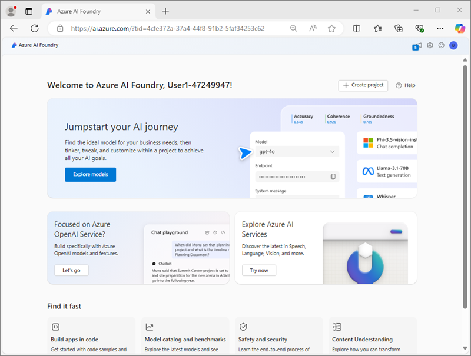
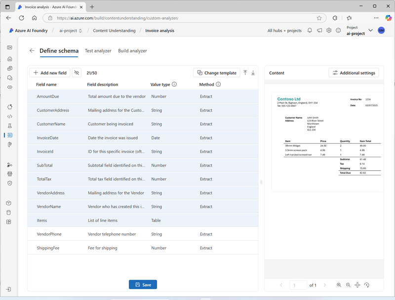
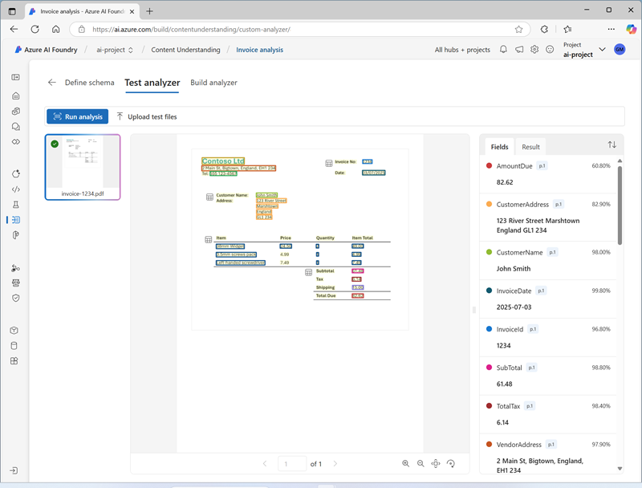

---
lab:
    title: 'Analyze content with Azure AI Content Understanding'
    module: 'Multimodal analysis with Content Understanding'
---

# Analyze content with Azure AI Content Understanding

In this exercise, you use Azure AI Foundry portal to create a Content Understanding project that can extract information from invoices. You'll then test your content analyzer in Azure AI Foundry Portal and consume it through the Content Understanding REST interface.

This exercise takes approximately **30** minutes.

## Create an Azure AI Foundry project

Let's start by creating an Azure AI Foundry project.

1. In a web browser, open the [Azure AI Foundry portal](https://ai.azure.com) at `https://ai.azure.com` and sign in using your Azure credentials. Close any tips or quick start panes that are opened the first time you sign in, and if necessary use the **Azure AI Foundry** logo at the top left to navigate to the home page, which looks similar to the following image:

    

1. In the home page, select **+ Create project**.
1. In the **Create a project** wizard, enter a valid name for your project, and if an existing hub is suggested, choose the option to create a new one. Then review the Azure resources that will be automatically created to support your hub and project.
1. Select **Customize** and specify the following settings for your hub:
    - **Hub name**: *A valid name for your hub*
    - **Subscription**: *Your Azure subscription*
    - **Resource group**: *Create or select a resource group*
    - **Location**: Choose one of the following regions\*
        - West US
        - Sweden Central
        - Australia East
    - **Connect Azure AI Services or Azure OpenAI**: *Create a new AI Services resource*
    - **Connect Azure AI Search**: *Create a new Azure AI Search resource with a unique name*

    > \*At the time of writing, Azure AI Content understanding is only avilable in these regions.

1. Select **Next** and review your configuration. Then select **Create** and wait for the process to complete.
1. When your project is created, close any tips that are displayed and review the project page in Azure AI Foundry portal, which should look similar to the following image:

    

## Create a Content Understanding analyzer

You are going to build an analyzer that can extract information from invoices. You'll start by defining a schema based on a sample invoice.

1. In a new browser tab, download the [invoice-1234.pdf](https://github.com/microsoftlearning/mslearn-ai-document-intelligence/raw/main/Labfiles/05-content-understanding/forms/invoice-1234.pdf) sample form from `https://github.com/microsoftlearning/mslearn-ai-document-intelligence/raw/main/Labfiles/05-content-understanding/forms/invoice-1234.pdf` and save it in a local folder.
1. Return to the tab containing the home page for your Azure AI Foundry project; and in the navigation pane on the left, select **Content Understanding**.
1. On the **Content Understanding** page, select the **Custom analyzer** tab at the top.
1. On the Content Understanding custom analyzer page, select **+ Create**, and create a task with the following settings:
    - **Task name**: Invoice analysis
    - **Description**: Extract data from an invoice
    - **Azure AI services connection**: *the Azure AI Services resource in your Azure AI Foundry hub*
    - **Azure Blob Storage account**: *The default storage account in your Azure AI Foundry hub*
1. Wait for the task to be created.

    > **Tip**: If an error accessing storage occurs, wait a minute and try again.

1. On the **Define schema** page, upload the **invoice-1234.pdf** file you just downloaded.
1. Select the **Invoice analysis** template and then select **Create**.

    The *Invoice analysis* tenplate includes common fields that are found in invoices. You can use the schema editor to delete any of thre suggested fields thatyou don't need, and add any custom fields that you do.

1. In the list of suggested fields, select **BillingAddress**. This field is not needed for the invoice format you have uploaded, so use the **Delete field** (**&#128465;**) icon that appears to delete it.
1. Now delete the following suggested fields, which aren't needed:
    - BillingAddressRecipient
    - CustomerAddressRecipient
    - CustomerId
    - CustomerTaxId
    - DueDate
    - InvoiceTotal
    - PaymentTerm
    - PreviousUnpaidBalance
    - PurchaseOrder
    - RemittanceAddress
    - RemittanceAddressRecipient
    - ServiceAddress
    - ServiceAddressRecipient
    - ShippingAddress
    - ShippingAddressRecipient
    - TotalDiscount
    - VendorAddressRecipient
    - VendorTaxId
    - TaxDetails
1. Use **+ Add new field** button to add the following fields:

    | Field name | Field description | Value type | Method |
    |--|--|--|--|
    | `VendorPhone` | `Vendor telephone number` | String | Extract |
    | `ShippingFee` | `Fee for shipping` | Number | Extract |

1. verify that your completed schema looks like this, and select **Save**.
    

1. On the **Test Analyzer** page, if analysis does not begin automatically, select **Run analysis**. Then wait for analysis to complete and review the text values on the invoice that are identified as matching the fields in the schema.
1. Review the analysis results, which should look similar to this:

    

1. View the details of the fields that were identified in the **Fields** pane, and then view the **Result** tab to see the JSON representation.

## Build and test an analyzer

Now that you have trained a model to extract fields from invoices, you can build an analyzer to use with similar forms.

1. Select the **Build analyzer** page, and then select **+ Build analyzer** and build a new analyzer with the following properties (typed exactly as shown here):
    - **Name**: `contoso-invoice-analyzer`
    - **Description**: `Contoso invoice analyzer`
1. Wait for the new analyzer to be ready (use the **Refresh** button to check).
1. Download [invoice-1235.pdf](https://github.com/microsoftlearning/mslearn-ai-document-intelligence/raw/main/Labfiles/05-content-understanding/forms/invoice-1235.pdf) from `https://github.com/microsoftlearning/mslearn-ai-document-intelligence/raw/main/Labfiles/05-content-understanding/forms/invoice-1235.pdf` and save it in a local folder.
1. Return to the **Build analyzer** page and select the **contoso-invoice-analyzer** link. The fields defined in the analyzer's schema will be displayed.
1. In the **contoso-invoice-analyzer** page, select the **Test** tab.
1. Use the **+ Upload test files** button to upload **invoice-1235.pdf** and run the analysis to extract field data from the test form.
1. Review the results of the test, and verify that the analyzer extracted the correct fields from the test invoice.
1. Close the **contoso-invoice-analyzer*** page.

## Use the Content Understanding REST API

Now that you've created an analyzer, you can consume it from a client application through the Content Understanding REST API.

1. In the **Project details** area, note the **Project connection string**. You'll use this connection string to connect to your project in a client application.
1. Open a new browser tab (keeping the Azure AI Foundry portal open in the existing tab). Then in the new tab, browse to the [Azure portal](https://portal.azure.com) at `https://portal.azure.com`; signing in with your Azure credentials if prompted.

    Close any welcome notifications to see the Azure portal home page.

1. Use the **[\>_]** button to the right of the search bar at the top of the page to create a new Cloud Shell in the Azure portal, selecting a ***PowerShell*** environment with no storage in your subscription.

    The cloud shell provides a command-line interface in a pane at the bottom of the Azure portal. You can resize or maximize this pane to make it easier to work in.

    > **Note**: If you have previously created a cloud shell that uses a *Bash* environment, switch it to ***PowerShell***.

1. In the cloud shell toolbar, in the **Settings** menu, select **Go to Classic version** (this is required to use the code editor).

    **<font color="red">Ensure you've switched to the classic version of the cloud shell before continuing.</font>**

1. In the cloud shell pane, enter the following commands to clone the GitHub repo containing the code files for this exercise (type the command, or copy it to the clipboard and then right-click in the command line and paste as plain text):

    ```
   rm -r mslearn-ai-foundry -f
   git clone https://github.com/microsoftlearning/mslearn-ai-document-intelligence mslearn-ai-doc
    ```

    > **Tip**: As you enter commands into the cloudshell, the output may take up a large amount of the screen buffer. You can clear the screen by entering the `cls` command to make it easier to focus on each task.

1. After the repo has been cloned, navigate to the folder containing the code files for your app:

    ```
   cd mslearn-ai-doc/Labfiles/05-content-understanding/code
   ls -a -l
    ```

1. In the cloud shell command-line pane, enter the following command to install the libraries you'll use:

    ```
   python -m venv labenv
   ./labenv/bin/Activate.ps1
   pip install dotenv azure-identity azure-ai-projects
    ```

1. Enter the following command to edit the configuration file that has been provided:

    ```
   code .env
    ```

    The file is opened in a code editor.

1. In the code file, replace the **YOUR_PROJECT_CONNECTION_STRING** placeholder with the connection string for your project (copied from the project **Overview** page in the Azure AI Foundry portal), and ensure that **ANALYZER** is set to the name you assigned to your analyzer (which should be *contoso-invoice-analyzer*)
1. After you've replaced the placeholders, within the code editor, use the **CTRL+S** command to save your changes and then use the **CTRL+Q** command to close the code editor while keeping the cloud shell command line open.

1. In the cloud shell command line, enter the following command to edit the **analyze_invoice.py** Python code file that has been provided:

    ```
    code analyze_invoice.py
    ```
    The Python code file is opened in a code editor:

1. Review the code, which:
    - Identifies the invoice file to be analyzed, with a default of **invoice-1236.pdf**.
    - Retrieves the endpoint and key for your Azure AI Services resource from the project.
    - Submits an HTTP POST request to your Content Understanding endpoint, instructing the to analyze the image.
    - Checks the response from the POST operation to retrieve an ID for the analysis operation.
    - Repeatedly submits an HTTP GET request to your Content Understanding service until the operation is no longer running.
    - If the operation has succeeded, parses the JSON response and displays the values retrieved
1. Use the **CTRL+Q** command to close the code editor while keeping the cloud shell command line open.
1. In the cloud shell command line pane, enter the following command to run the Python code:

    ```
    python analyze_invoice.py invoice-1236.pdf
    ```

1. Review the output from the program.
1. Use the following command to run the program with a different invoice:

    ```
    python analyze_invoice.py invoice-1235.pdf
    ```

    > **Tip**: There are three invoice files in the code folder that you can use (invoice-1234.pdf, invoice-1235.pdf, and invoice-1236.pdf) 

## Clean up

If you've finished working with the Content Understanding service, you should delete the resources you have created in this exercise to avoid incurring unnecessary Azure costs.

1. In the Azure AI Foundry portal, navigate to the **travel-insurance** project and delete it.
1. In the Azure portal, delete the resource group you created in this exercise.

